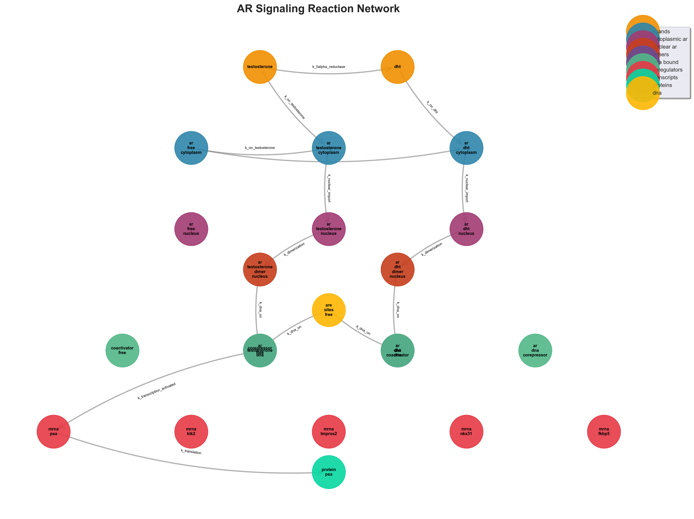

# androgen receptor signaling simulation

computational model of ar signaling in male reproductive system and prostate cancer. simulates molecular dynamics from ligand binding through transcriptional activation.

## biology

**pathway**: testosterone/dht → ar binding → nuclear translocation → dimerization → dna binding → transcription

**key species**: ar, testosterone, dht, ar:ligand complexes, dimers, dna-bound complexes, target mrnas (psa, klk2, tmprss2, nkx3.1)

**cancer relevance**: ar amplification, mutations, splice variants (ar-v7), castration resistance

**therapeutic targets**: enzalutamide, apalutamide, bicalutamide, darolutamide, abiraterone, finasteride, arv-110

## model

**methods**: ode (deterministic), gillespie (stochastic), compartmental (cytoplasm/nucleus), mass action kinetics

**network**: 23 species, 50+ reactions



**parameters**: literature-based (ar_total=1000 molecules/cell, kd_testosterone=10nm, kd_dht=1nm, k_import=0.5s⁻¹, t_half_ar=2-4h)

## structure

```
src/models/           # pathway, parameters
src/simulation/       # simulator, sensitivity
src/visualization/    # timeseries, networks, interactive
src/analysis/         # statistics, bifurcation
scripts/              # run_simulation.py, drug_comparison.py
notebooks/            # jupyter demos
```

## install

```bash
git clone <repo>
cd androgen-receptor-signaling-sim
python -m venv venv && source venv/bin/activate
pip install -r requirements.txt && pip install -e .
```

## usage

```bash
python scripts/run_simulation.py          # basic simulation
python scripts/drug_comparison.py         # drug screening
python scripts/sensitivity_analysis.py    # parameter sensitivity
```

```python
# programmatic
from src.models.ar_pathway import ArPathwayModel
from src.simulation.simulator import Simulator

model = ArPathwayModel()
simulator = Simulator(model, time_end=10000, dt=0.1)
results = simulator.run(testosterone=1e-9, dht=1e-9)
```

## visualizations

- pathway diagrams: molecular interactions, compartmentalization
- timeseries: temporal dynamics, stochastic ensembles
- dose-response: ec50, hill coefficients
- phase portraits: 2d/3d state space
- sensitivity heatmaps: parameter influence
- network graphs: reaction topology
- bifurcation diagrams: stability transitions
- interactive dashboards: real-time exploration

## modes

- **ode**: deterministic, fast, population averages
- **gillespie**: stochastic, single-cell, intrinsic noise
- **hybrid**: combined, optimal efficiency

## analysis

- equilibrium: steady-states, stability
- dynamics: oscillations, frequency
- bifurcation: stability transitions, hysteresis
- sensitivity: local/global, sobol indices
- monte carlo: uncertainty, confidence intervals

## applications

- mechanism elucidation, hypothesis testing
- cancer castration resistance, ar variants
- drug development, pk/pd modeling
- precision medicine, treatment prediction

## references

1. tyagi et al. (2000) mol endocrinol - ar translocation dynamics
2. henderson et al. (2006) genome biol - ar binding/transcription
3. watson et al. (2015) nat rev cancer - resistance mechanisms
4. antonarakis et al. (2014) nejm - ar-v7 resistance

## license

mit license
